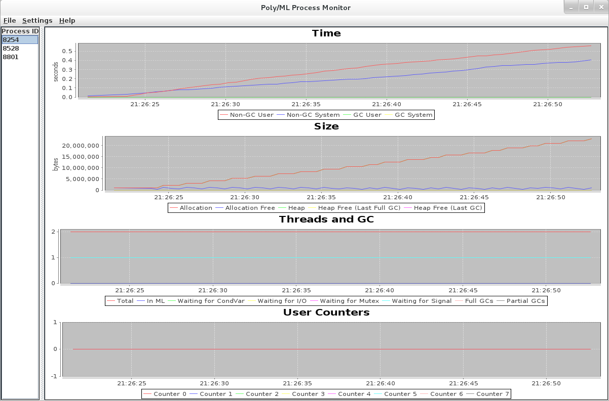

Poly/ML Monitor
===============

A graphical monitoring application for Poly/ML processes.

By Magnus Stenqvist and Tjark Weber <tjark.weber@it.uu.se>.

Project Website
---------------

https://github.com/tjark/Poly-ML-Monitor

Installation Notes (Linux)
--------------------------

1. Install [Java][1]. Make sure that `java` invokes the Java VM.

2. Install [Poly/ML][2]. The monitor is known to work with Poly/ML
5.5.3. Use other versions at your own risk.

3. Make `poly-ml-monitor.tgz`.

4. Unpack `poly-ml-monitor.tgz`. Run `poly-ml-monitor`.

*Caveat:* If you have several versions of Poly/ML on your machine,
make sure that the Poly/ML monitor and the application(s) that you
want to monitor are using the same version. Use `Settings > Poly/ML
Command` to point the Poly/ML monitor to a specific Poly/ML
executable.

Other operating systems are currently unsupported. Feel free to submit
a feature or pull request.

Bugs
----

Please report bugs and feature requests via the [issue tracker][3].

[1]: http://www.java.com/
[2]: http://www.polyml.org/
[3]: https://github.com/tjark/Poly-ML-Monitor/issues
